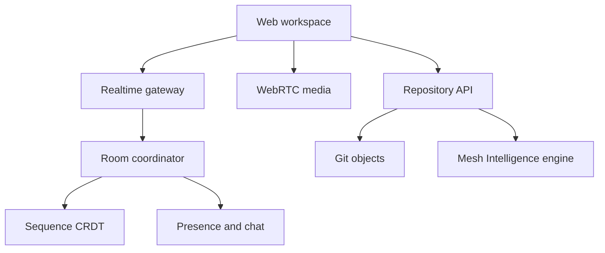

# MeshForge

MeshForge is a portfolio-grade collaborative source workspace: repository navigation, multiplayer editing, presence, room chat, voice controls, performance telemetry, and AI-assisted code review in one focused interface.

The current milestone is an interactive product slice. It proves the experience and interaction model while the realtime protocol, durable repository storage, and media plane are developed as independent services.

## Why this project

MeshForge is intentionally designed to demonstrate three different engineering profiles in one coherent product:

- **Software engineering:** replication protocols, consistency models, versioned APIs, testing, observability, and failure recovery.
- **Web engineering:** responsive product UI, accessible interactions, optimistic state, streaming transport, and performance budgets.
- **AI engineering:** retrieval-aware code context, patch generation, reviewable diffs, evaluation datasets, and latency/cost instrumentation.

## Current experience

- Signal Room collaborative workspace
- Repository explorer and source editor
- D1-backed repositories with SHA-256 content-addressed blobs, immutable tree snapshots, branch refs, and commit DAG history
- Optimistic branch-head checks and Myers line-diff statistics for each commit
- Branch creation and switching, pull-request snapshots, changed-file review, and guarded merge commits with two parents
- Editable shared source document with room-scoped presence and cursor offsets
- WebSocket fast path with durable replay and polling recovery
- Voice-room controls and speaking state
- Working room chat composer
- Peer-to-peer WebRTC audio with short-lived room signaling, explicit microphone opt-in, mute/leave controls, and active-speaker metering
- Self-contained Mesh Intelligence review with dependency graphs, complexity hotspots, security/performance rules, duplicate-code detection, and deterministic patches
- CRDT throughput, peer count, connection, and p95 latency telemetry
- Responsive layout that preserves the editor and collapses secondary panels

## Architecture direction



See [`docs/ARCHITECTURE.md`](docs/ARCHITECTURE.md) for component boundaries, data structures, complexity targets, and the implementation roadmap.

## Algorithmic core

`lib/collaboration/indexed-treap.ts` implements an order-statistic treap—the local sequence index beneath the planned CRDT layer. Every node maintains subtree size, allowing position lookup, insertion, removal, split, and merge in expected `O(log n)` time. The deterministic priority function makes replicas reproducible in tests.

This structure avoids repeatedly scanning the entire document when translating between editor offsets and replicated operations. Future milestones layer stable CRDT identifiers and tombstone compaction over the same index.

## Product roadmap

1. **Experience prototype** — current interactive workspace.
2. **Realtime text** — implemented: WebSocket rooms, durable operation replay, sequence CRDT, live presence, reconnect backoff, polling recovery, and shuffled-delivery convergence tests. Next: binary operation encoding and tombstone compaction.
3. **Source management** — implemented repository snapshots, content-addressed objects, branch creation/switching, commits, pull requests, two-parent merge commits, diffs, deduplication metrics, and stale-base protection. Next: multiple repositories, conflict-aware rebasing, review comments, and permissions.
4. **Voice and chat** — implemented peer-to-peer WebRTC mesh audio and resilient short-lived HTTP signaling. Next: TURN relay, device selection, moderation, and SFU migration for larger rooms.
5. **Repository intelligence** — implemented local dependency analysis, risk ranking, rolling-hash duplicate detection, complexity hotspots, and deterministic patch generation with no external API dependency. Next: language-aware parsers, test-impact analysis, and an offline open-weight model option.
6. **Scale proof** — load tests, flamegraphs, SLO dashboard, chaos tests, and a public engineering write-up.

## Run locally

Requires Node.js 22.13 or later.

```bash
npm install
npm run dev
```

Then open the local address printed by the development server.

## Verification

```bash
npm run lint
npm test
```

The production build emits a Cloudflare-compatible worker artifact. Text operations, chat events, and presence heartbeats use the realtime room protocol; text and chat survive socket reconnects through the durable event log. Audio uses direct peer-to-peer WebRTC after explicit microphone permission. SDP/ICE signaling records expire after 60 seconds and audio media is never stored or relayed through the application server. A TURN service is still required for reliable connectivity across restrictive enterprise networks.
